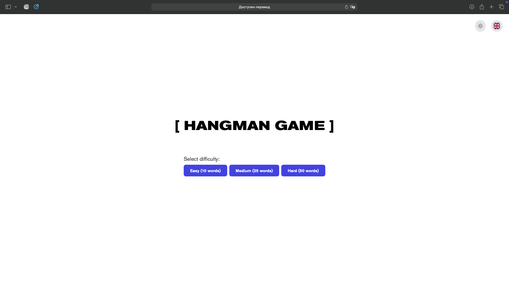

# Hangman Game

## Description / Описание

### English

This is a simple hangman game with random words and 3 difficulty levels. The game is written in pure JavaScript and features:

- Dark and light themes
- Language switching (English/Russian)
- 3 difficulty levels
- Random word selection

### Русский

Простая игра "Виселица" с случайными словами и 3 уровнями сложности. Игра написана на чистом JavaScript и включает:

- Тёмную и светлую темы
- Переключение языков (русский/английский)
- 3 уровня сложности
- Случайный выбор слов

## Installation and Running / Установка и запуск

```bash

# Install dependencies / Установка зависимостей
npm install

# Run in development mode / Запуск в режиме разработки
npm run dev
```

## Technologies / Технологии

- JavaScript
- HTML
- CSS

## Screenshots / Скриншоты




